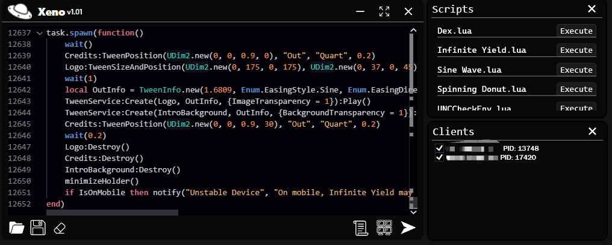
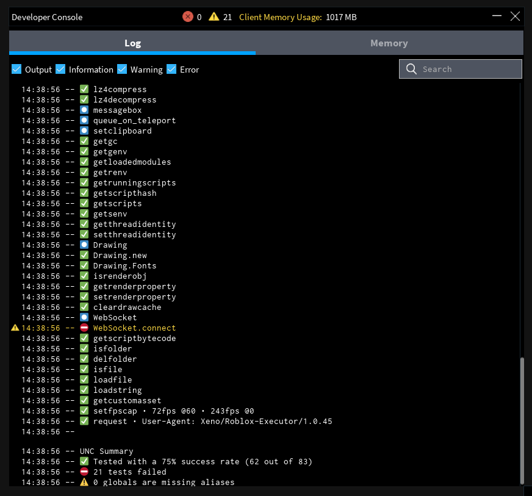

> [!WARNING]
> You are most likely going to be banned since this is detected by Byfron. Use an alt account while running Xeno. Use the repository to understand what's happening and how it works.
> I am not liable for any bans

# LuauAPI
An executor made for the web version of Roblox.

It uses the common method of writing unsigned bytecode into a Roblox core module script to manage execution, also more stable and flexible than most executors that has used this exact method.

## Note
If you're going to use my source and "skid" off of it atleast use the license and give credits. Don't be like the others who used my entire source code and claimed it as their own without mentioning anything about Xeno nor the publisher + distributing & selling to others.

## Features
- Fast execution
- Multi-instance compatibility
- Supports executing most scripts including Lua Armor scripts
- Uses extremely fast virtual filesystem that syncs to the external
- No in-game performance change & no high CPU usage
- Custom functions like HttpSpy, getting the real address of a Instance, setting & getting globals across all clients, and spoofing instance

The current method of adding **HttpGet** to "game" interferes with some scripts like [**dex**](https://raw.githubusercontent.com/infyiff/backup/main/dex.lua). To execute dex run this script:
```lua
getgenv().game = workspace.Parent
```
This will remove **HttpGet** from game!
You can use the modified version of dex made for Xeno inside the released files

### Preview
<p>This is the UI of the version 1.0.1:</p>

<p>The Current UNC is <span style="color: green;">~75%</span></p>


## Dependencies
This project uses the following libraries:

- [**httplib**](https://github.com/yhirose/cpp-httplib)
- [**xxhash**](https://github.com/Cyan4973/xxHash)
- [**zstd**](https://github.com/facebook/zstd)
- [**openssl**](https://github.com/openssl/openssl)

Dependencies are managed with [**vcpkg**](https://github.com/microsoft/vcpkg). Install them with this command:
```sh
vcpkg install xxhash zstd openssl
```

The proper version of **httplib** is already included inside this project